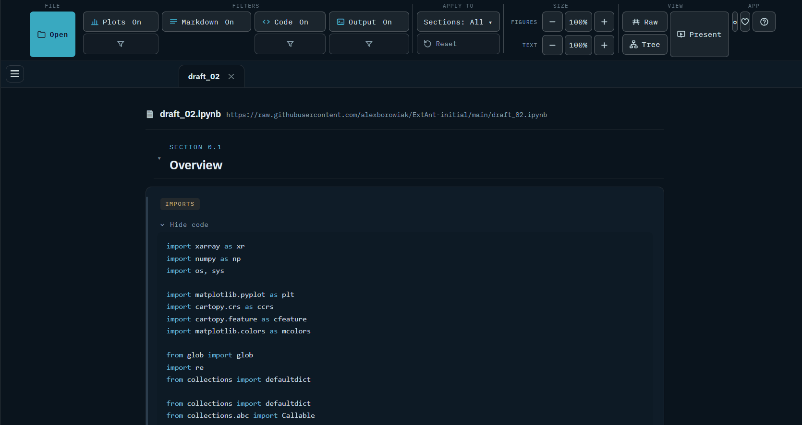
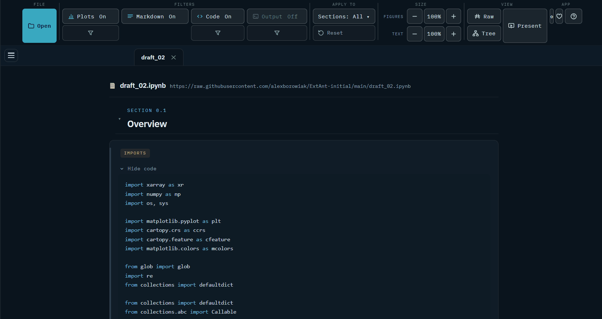
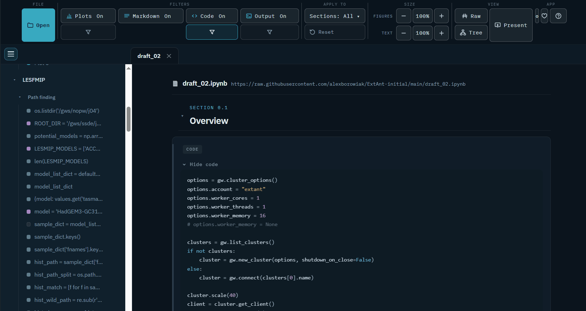
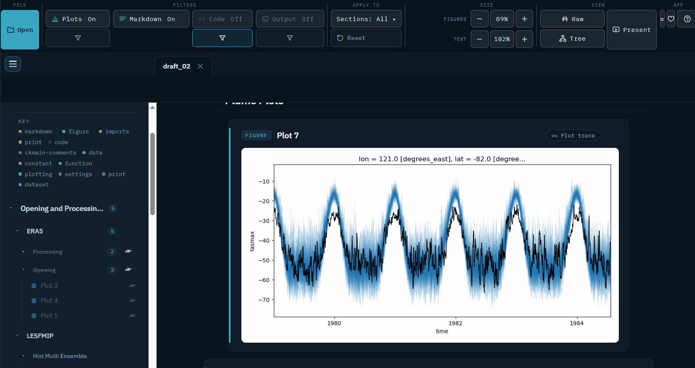
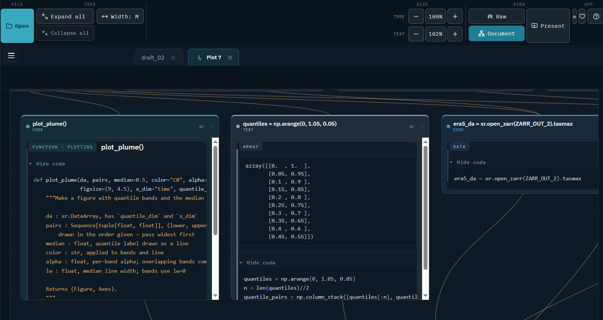
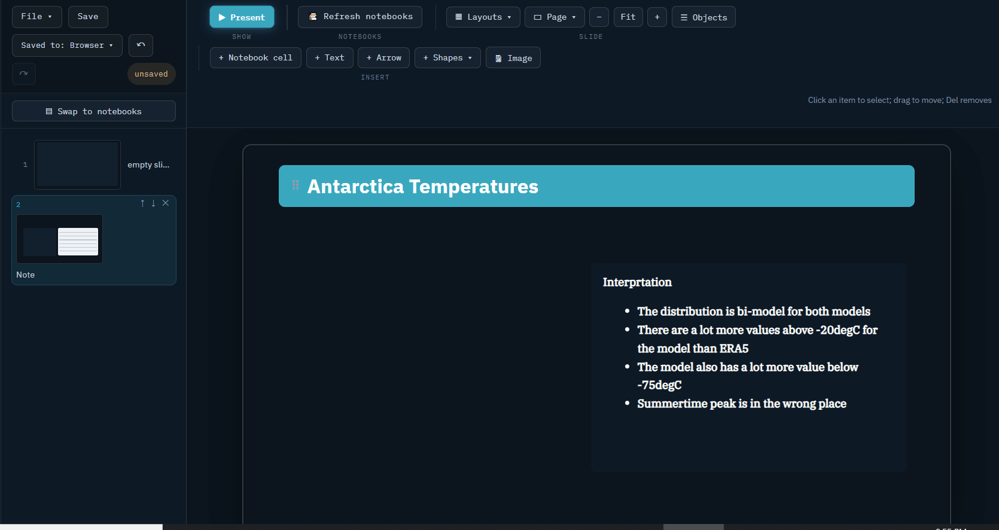
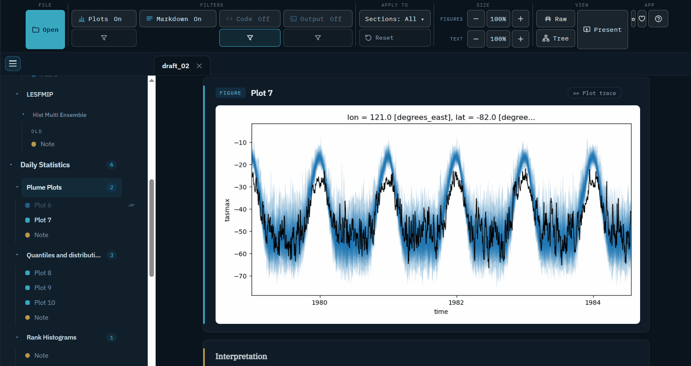

# Junoview

**Figure-first viewing of executed Jupyter notebooks — and presentations built from the same cells.**

[](https://github.com/alexborowiak/junoview/actions/workflows/ci.yml)
[](https://pypi.org/project/junoview/)
[](https://pypi.org/project/junoview/)
[](LICENSE)

> NASA's **Juno** probe viewed Jupiter; **Junoview** views your **Jupyter**.

```bash
pip install junoview   # then: junoview
```

**▶ [Live demo — no install](https://junoview.dev/example_climate_analysis.html)** &nbsp;·&nbsp; a real climate-diagnostics notebook, rendered.



Turn an **executed** Jupyter notebook into a figure-first, nonlinear analysis
environment. Instead of rendering every cell with equal weight (the Quarto /
nbconvert model), it recovers the scientific structure underneath the notebook —

```
Dataset → Transform → Diagnostic → Figure → Interpretation
```

— and renders figures as the primary objects, with code collapsed behind them,
sections in a navigable rail, and a live **provenance graph** of how each
diagnostic derives from the data.

There is no kernel and no re-execution: run your notebook once, normally, in
Jupyter; the renderer reads the outputs already stored in the `.ipynb`. The only
dependency is the Python standard library.

## Contents

| | |
| --- | --- |
| [Run it](#run-it) | the app, static export, and publishing to the web |
| [What you get in the page](#what-you-get-in-the-page) | the reading experience |
| [Authoring guide](AUTHORING.md) | the `#\|` directive language, in full |
| [Presentations](PRESENTATIONS.md) | slide decks and conference posters |
| [Jupyter widget](WIDGET.md) | the live, in-kernel view |
| [Architecture](ARCHITECTURE.md) | how the code is laid out |
| [Contributing](CONTRIBUTING.md) | how to get set up and send a change |
| [Changelog](CHANGELOG.md) | what changed, and what moved |
| [Backlog](TASKS.md) | what is left to do, and the design record of what was built |
| [Audit](AUDIT-2026-08-26.md) | the evidence behind the open items |

## See it work

<details>
<summary><b>Filtering by code type</b> — keep the plotting, drop the imports</summary>


</details>

<details>
<summary><b>Hiding what you don't want</b> — strip a notebook to its argument</summary>


</details>

<details>
<summary><b>Plot trace</b> — the exact chain of cells behind a figure</summary>


</details>

<details>
<summary><b>Tree view</b> — the whole analysis as a dependency map</summary>


</details>

<details>
<summary><b>Building a presentation</b> — drag cards onto slides</summary>


</details>

<details>
<summary><b>Present mode</b> — scale figures and text, then go full screen</summary>


</details>

---

## Run it

### The app (recommended)

```bash
junoview
```

launches a small local server and opens the **semantic notebook app** in your
browser. The layout is IDE-style: a **controls bar** on top (**+ Open**
and the global Hide/Show filters, left-aligned), the **notebook tabs**
beneath it, and a vertical **presentations rail** down the left edge.

- **+ Open** (controls bar, top left) browses your file system; or just
  **drag-and-drop `.ipynb` files** anywhere onto the window — or paste a
  **URL** into the open dialog (GitHub `blob` links are converted to raw
  automatically). URL notebooks reload with ↻ and come back on restart.
- Every notebook opens as a **tab**. Click to switch, **↻** re-reads a
  notebook from disk after you re-run it in Jupyter, **✕** closes it.
- The **presentations rail** (left edge) stacks your presentations
  vertically under a **Documents** button. Exactly one item is active at a
  time: click a ▶ presentation to open it in the builder, click
  **Documents** to go back — that button is always visible, so there is
  always an obvious way out (`Esc` and the builder's **✕ Close** work
  too). **New** starts a presentation; unsaved drafts carry an amber dot
  and stay listed while you work on others. **«** collapses the rail to
  icons, and again to hide it completely — a small **»** handle at the
  bottom-left brings it back. While the builder is docked, notebook tabs
  keep working — switch tabs to pull cards from different notebooks into
  the same deck.
- Open tabs and recent files are remembered in `junoview_project.json` next to
  where you launched the app — restart later and your workspace comes back.
- Presentations can **mix cards from every open tab** and save into the same
  project file — see [PRESENTATIONS.md](PRESENTATIONS.md).

Options: preload tabs with `junoview --app A.ipynb B.ipynb`;
choose the project folder with `--root`, the port with `--port`, and skip the
auto-opened browser with `--no-browser`. The server binds to `127.0.0.1` only
and the URL carries a session token.

### Static export

For a shareable, self-contained page (no server needed to view it):

```bash
# one notebook -> my_notebook.html next to it
junoview my_notebook.ipynb

# choose output / title
junoview my_notebook.ipynb -o report.html --title "Run 42"

# several notebooks -> ONE page with tabs (default: semantic_view.html)
junoview part1.ipynb part2.ipynb -o project.html
```

Open the example to see it:

```bash
junoview examples/example_climate_analysis.ipynb
open examples/example_climate_analysis.html
```

The example ships already executed, so it renders with no extra dependencies.
To re-run it yourself first (needs `nbclient`, `xarray`, `matplotlib`):

```bash
jupyter execute examples/example_climate_analysis.ipynb   # or run it in Jupyter
junoview examples/example_climate_analysis.ipynb
```

### Publish it — the hosted web version

The tool ships as a **fully client-side web app**: the very same Python code
runs *in the visitor's browser* via [Pyodide](https://pyodide.org)
(Python compiled to WebAssembly). There is no backend at all, which means
free static hosting, nothing to maintain, and — the important part for
science — **notebooks are never uploaded anywhere**; files people open
stay on their machine.

```bash
junoview --build-web docs
```

writes `docs/index.html` + `docs/junoview.zip` (the renderer, which the page
unpacks into Pyodide). The archive is written deterministically, so rebuilding
without source changes produces no diff. To publish on GitHub Pages:

1. Commit the `docs/` folder and push.
2. On GitHub: *Settings → Pages → Source: Deploy from a branch →*
   `main` */docs*.
3. Your tool is live at `https://<you>.github.io/<repo>/`.

(Any static host works — Netlify, Cloudflare Pages, a plain web server.)
The web version supports drag-and-drop, a file picker, and opening
notebooks by URL; presentations autosave as browser drafts and can be
downloaded as JSON or saved into a notebook via the file picker. The
build bundles the example notebook, so first-time visitors get a
**Try the example notebook** button, and every mode has a **Help**
overlay covering the directives and everything the tool can do. The
first visit downloads the Python runtime (a few MB, then cached).

**Do not deploy the local app server (`--app`) to a public machine** —
it is deliberately single-user: it binds to `127.0.0.1` and browses the
host's filesystem. The web build above is the safe public face; the app
server is for your own machine.

### Use it offline — install it as an app

The web build is a **PWA**: the first visit caches the page, the Python
runtime and the maths fonts, and every visit after that works **with no
internet at all** — on a plane, on conference Wi-Fi, wherever. The
browser will also offer to **install it as an app** (menu → *Apps →
Install Junoview*, or the *Install as an app* link on the welcome
screen): you get a Start-menu/dock icon and its own window, and it keeps
working offline. Nothing to install by hand, nothing uploaded — it is
the same fully client-side app.

Presentations survive offline too: saved decks embed their own copies of
every placed card, so a `.junoview.html` file presents with its figures
even when the notebook it came from isn't there — see
[PRESENTATIONS.md](PRESENTATIONS.md).

### Install as a command

```bash
pip install junoview     # or: pipx install junoview
junoview                 # launches the app from anywhere
```

Or from a checkout: `pip install .` (add `pipx` to isolate it). The Jupyter
widget extras come with `pip install "junoview[widget]"`.

---

## What you get in the page

- **Left rail** — section tree plus a live analysis graph. Scrolling highlights
  the active section and its node; clicking a node jumps to that card.
- **Figure stage** — each diagnostic as a card: title, output, serif caption,
  amber `derives from …` provenance chips (click to jump to a source), and a
  collapsible code block.
- **Controls bar** (top row, global — it applies to every tab) — three
  buttons whose labels follow the state: *Hide/Show figures*, *Hide/Show
  markup* (the markdown/equation cells) and *Hide/Show code*. **Show
  code shows ALL code**: it reveals the code-only cards *and* unfolds the
  code tucked under every figure and dataset card in one click. Any
  combination works — hide code for a figures-plus-documentation reading
  view, leave only markup for just the prose. A hidden card collapses to
  a slim dashed stub that expands in place when clicked.
- **Raw notebook** (controls bar) — flips the active tab to the notebook
  exactly as authored: every cell in order, `#|` directives visible,
  outputs underneath. This is the transparency view — it shows precisely
  where each card's title, caption and section came from. Click again
  (or any nav link) to return to the formatted view.
- **Notebook tabs** (beneath the controls) — one per open notebook.
- **Presentations rail** (left edge, vertical) — a **Documents** button on
  top, then your presentations; the active item is highlighted.
- Responsive to mobile, keyboard-navigable, respects reduced-motion.

---

## Authoring a notebook for it

You annotate cells with `#| key: value` **directive lines at the very top of a
code cell** — all of them optional. What you leave out is inferred: an image
output is a figure, an xarray repr is a dataset, bare text is a print.

```python
#| display: figure
#| id: clim
#| depends: load
#| title: Climatology
#| caption: Note the ridge over the Tasman.
plot_climatology(ds)
```

Markdown headings open sections, and prose beneath a heading becomes the
interpretation attached to the figure it discusses.

**→ [AUTHORING.md](AUTHORING.md)** covers the whole language: every directive,
grouping vs stacking, section tiers, and what happens with no directives at all.

## Presentations

Drop cards onto slides, pick a **slide layout**, and present full screen — or
lay out an A0 conference poster from the same cells. Formatting for the thing
you click lives on its contextual **Object** tab; the permanent **Ribbon
layouts** button switches the arrangement of the editor itself. Decks live in
the notebook's own metadata, so re-running the notebook updates the slides.

**→ [PRESENTATIONS.md](PRESENTATIONS.md)** covers the builder, decks that mix
several notebooks, and where presentations are saved.

## Live in Jupyter

The static page is for sharing. When you want to *explore*, `SemanticNotebook`
renders the same figure-first view **inside a notebook**, against the live
kernel — with view state that persists back to Python, and figures that
recompute from a slider.

**→ [WIDGET.md](WIDGET.md)** covers setup, parameter shorthands and
`export_html`.

---

## Design notes

- The code lives in `src/junoview/`, split by what each part does: reading
  notebooks (`notebook/`), rendering them (`render/`), the frontend as real
  `.css`/`.js`/`.html` files (`assets/`), and the local app (`server/`).
  [ARCHITECTURE.md](ARCHITECTURE.md) is the map — it explains the one seam that
  matters and gives a twenty-minute reading order.
- No runtime dependencies: the core is pure standard library, which is why the
  in-browser build works at all. There is no build step and no Node toolchain —
  edit a `.css` or `.js` file under `src/junoview/assets/` and re-render.
- `pytest` runs the suite. See [CONTRIBUTING.md](CONTRIBUTING.md) to get set up.
- Because the static page is precomputed, its interactivity is limited to what
  can be baked in (navigation, provenance highlighting, code toggles). For a
  *live* kernel — recompute and persistent arrangement — use
  [the widget](WIDGET.md).

## Licence and citation

Apache-2.0 — see [LICENSE](LICENSE) and [NOTICE](NOTICE). If you use Junoview in
published work, [CITATION.cff](CITATION.cff) carries the citation metadata, which
is what GitHub's *Cite this repository* button reads.
